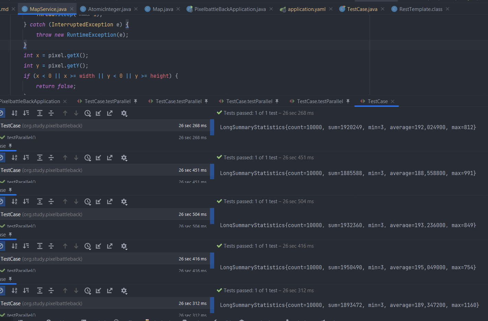
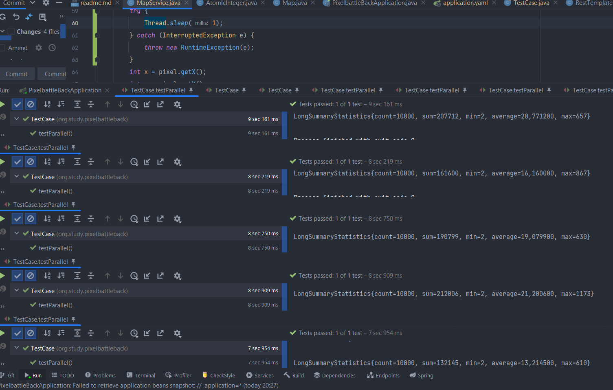

# Pixel Battles
## Постановка задачи
Дана карта 100х100, реализовано REST API для окрашивания клетки в цвет.
Исходно карта выполнена в виде одномерного массива и доступ к нему осуществляется из критической секции.

Требуется оптимизировать конкурентный доступ к карте. Структуру данных для хранения поля можно изменить по вашему усмотрению.

Помимо технической реализации проекта, потребуется ниже описать вашу идею оптимизации и примененные техники.

В тестах приведен пример нагрузочного тестирования. Прежде чем приступать к заданию, стоит замерить производительность образца.
И затем сравнивать результаты после оптимизации.

## Описание идеи
TODO: Заполнить после выполнения

Для хранения карты использую массив AtomicInteger чтобы не было блокировки,
конкуренция будет только при попытке установить цвет в одну ячейку. 
Если при выполнении операции compareAndSet поток получит false, 
придется получить новое значение цвета и снова пробовать установить свой цвет.
Насколько я понимаю ->
Из-за того что метод draw простой, незаметно особого выигрыша в новой реализации, 
для того чтобы увидеть разницу в тестовых замерах добавила sleep на 1 миллисекунду 
До оптимизации из-за того что каждый поток засыпает и в это время никто другой не может быть в методе, 
заметен прирост среднего времени выполнения 

После оптимизации average около 20 мс несмотря на то, что в тесте поставила чтобы потоки меняли один и тот же пиксель (самая большая конкуренция)
